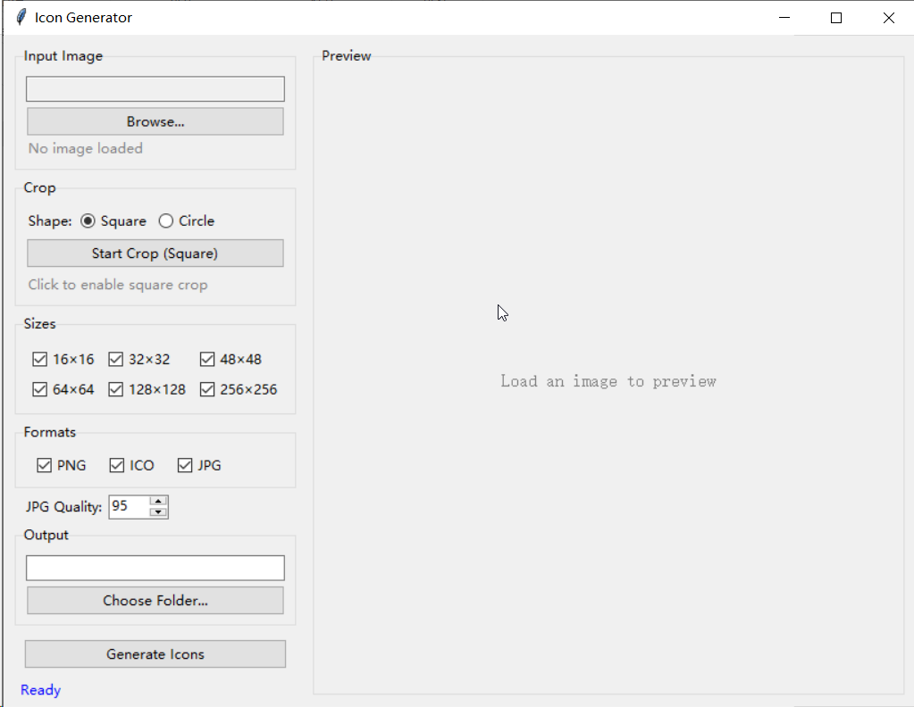

# genIcon(Icon Generator )

[中文说明](README.md) | English

A lightweight Windows desktop tool for generating app icons: export any image into multiple sizes and formats at once, with a built-in 1:1 crop tool (square / circle shapes).

Built with Python + Tkinter + Pillow in a single file, and can also be packaged into a standalone exe.



## Features

- **Multiple input formats**: PNG, ICO, JPG/JPEG, BMP, GIF, TIFF
- **Batch export**: pick any combination of sizes (16 / 32 / 48 / 64 / 128 / 256) and formats (PNG / ICO / JPG)
- **1:1 crop tool**:
  - Two shapes: square or circle
  - Drag the box to move it, corner / edge handles to resize, click a dimmed area outside the box to draw a new one
  - Live pixel size and position of the crop region on the original image
- **Circular output**: everything outside the circle becomes transparent (PNG / ICO); JPG gets a white background; the edge is anti-aliased with 4× supersampling so it stays smooth even at 16 px
- **Adjustable JPG quality**: 10–100, default 95; transparency is flattened onto white when exporting JPG

## Output Naming

```
{original_name}_{width}x{height}.{format}
```

For example, loading `logo.png` with all sizes and formats selected produces `logo_16x16.png`, `logo_32x32.ico`, etc. — 18 files — saved into the chosen output folder.

## Usage

### Option 1: Run the exe

Double-click `dist/genicon.exe` — no Python installation needed.

### Option 2: Run from source

Requirements: Python 3.8+ (tkinter included), Pillow.

```bash
pip install pillow
python genicon.py
```

### Basic Workflow

1. Click **Browse...** to pick an image; a preview appears on the right
2. (Optional) In the **Crop** panel, pick a shape (Square / Circle) and click **Start Crop**:
   - Drag the box to reposition; drag the corner / edge handles to resize
   - Click a dimmed area outside the box to start a new box from that point
   - In circle mode, dragging inside the disc moves it; clicking a dimmed corner starts a new box
   - Click the button again (Cancel Crop) to turn cropping off
3. Check the sizes and formats you need, and set the JPG quality
4. **Choose Folder...** to pick an output directory (defaults to the image's folder)
5. Click **Generate Icons**

> Tip: in circle mode, even without enabling the crop, the largest centered square region is used automatically, so non-square images are never distorted.

## Building the exe

```bash
python -m PyInstaller genicon.spec --noconfirm
```

The result is a single-windowless `dist/genicon.exe`. UPX compression is used automatically if installed; the build works fine without it.

## Project Structure

```
genicon/
├── genicon.py       # Main program (all logic, single file)
├── genicon.spec     # PyInstaller build configuration
├── README.md        # Chinese documentation
├── README_EN.md     # English documentation
├── docs/
│   └── screenshot.png
├── build/           # PyInstaller intermediate artifacts
└── dist/
    └── genicon.exe  # Standalone ready-to-use executable
```
